# Git: Overview

(*Note: GitHub lets you host (static) webpages for all of your projects, for free. The [webpage](matthewwolff.github.io/git_workshop/) associated with this project is just an HTML document that I generated from the README using [`pandoc`](https://pandoc.org/)*.)

---

### Before starting:
* Download [Github Desktop](https://desktop.github.com/)
* Join [GitHub](https://github.com/join) by creating an account
	- Use a professional-enough name, since you'll typically include this in your résumé

---

## What is Version Control?
Imagine you're working on a paper CancerEvolution.docx and you re-write a section but you're not sure if you want to keep it. Therefore, you "Save As" under "CancerEvolutionRewrite.docx". As you're working on this you end up re-writing another section and "Save As" to create a slightly different copy. Or maybe you just create draft after draft and want to have different versions for later. You're essentially creating different version of the same document and manually organizing them on your desktop! Not very effective though.

Take this up a level. We're developing some bioinformatic sequencing software. Because we're good developers, we write modular code and have many small files of code that we can re-use across the application. As we try out new algorithms, these files change and improve—but imagine trying to just send around the latest copy of these files or upload them all to Google drive—what if someone overwrites a copy of new changes with their own, older changes, and it breaks everything? We need stronger version control!

## What is Git?
A version control system for code! Gone are the days of "FinalPaperDraft.docx", "FinalPaperDraftFinal.docx", "FinalPaperDraftFinalFinal.docx".

> "By far, the most widely used modern version control system in the world today is Git. Git is a mature, actively maintained open source project originally developed in 2005 by Linus Torvalds, the famous creator of the Linux operating system kernel. A staggering number of software projects rely on Git for version control, including commercial projects as well as open source."

It's extremely useful for tracking and undoing changes to your code over time, as well as sharing your code with others.

## What is GitHub?
It's a online platform that lets you store and version control your code. It's built around Git. There are others like it, such as GitLab and BitBucket.

## So what's the meaningful difference between them?
Good question. Git exists purely on the command line, and is maintained independently from these platforms. You don't need to know the command line to use GitHub or GitLab, you just need to understand what version control is (and how to copy-paste)!

## How to use GitHub?
There are a few different ways!

1. Their Website -- [Github.com](http:/github.com)  
	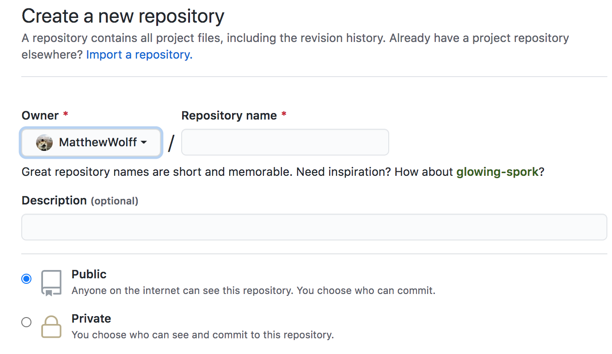
2. The desktop app – [Github Desktop](https://desktop.github.com/)  
	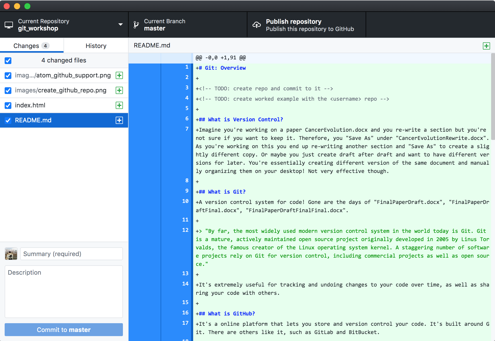
3. The command line – `hub` – `brew install hub`  
	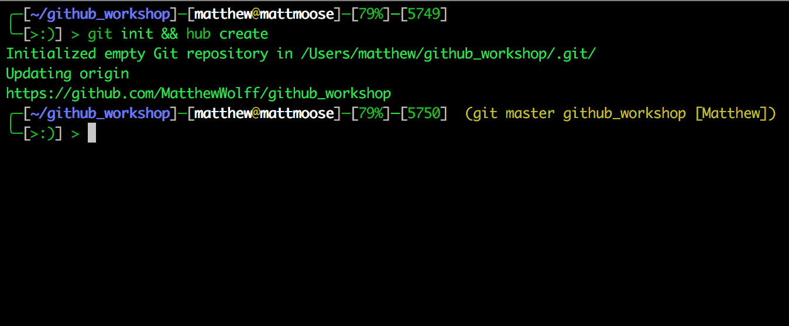
	- the only\* thing you can't do with standalone `git` is create repositories
4. An IDE like Atom!  (GitHub integration)  
	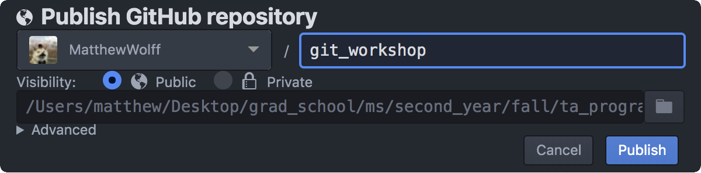

As a note, being a student gets you a [premium version (Github Student Dev pack)](https://education.github.com/pack) of Github for free

>It includes everything in GitHub Free, unlimited collaborators for private repositories, and advanced code review tools for private and public repositories.

Not only is it good for storing code and versioning it, it also is excellent for sharing your work. As you navigate through various pages on GitHub, you'll find there is often a small writeup on some pages called the "README.md". Whenever GitHub finds a file called README in a repository or folder of a repository, it will display that for you when you're viewing it.  

 That little document often contains instructions to compile their code, information about the different parameters it takes, and even some examples! We'll revisit this later.

---

# Git Concepts
## The Repository
* When you are working on a project and want to use version control, you need to first create a repository ("repo") for it
* You need to interface with Github for this (or install the `hub` command)
* It can be public or private
* The repository is where you'll send your updates

### Cloning
When you want to grab someone's repo, you don't have to just download the current code. You can `git clone` the repo, which will give you an exact copy of its current state.

## Commits
* When you make changes, you need to submit them to be saved
* You need to specify which changes you want to save!
	- You might have various things that you're working on, and only finished one of them that you want to commit
* You must "git add" the files that you want to "save"
* A commit is like a "soft-save" because it's only local
	- this can be nice—you don't always have an internet connection
* You need to publish your commits to make them global and visible to others!

## Pushing, Pulling
This is how we publish and retrieve changes!  

You push your local changes out to the repo, and then others can pull them in. Sometimes you've edited the same thing as someone else, and Git can't figure out how to automatically combine them—this is when you'll need to decide what to keep and what to toss. Situations like this can be frustrating when you're working with other people, so sometimes it's nice to have your own git workspace.

## Branching
Want to start adding something new but don't want to interfere with the stable code? Time to start a new branch! By default, you're on the "master" branch.

```bash
> git checkout -b dev_branch
Switched to a new branch 'dev_branch'
```

Branches are useful for developing new features in isolation. Creating a new branch creates a copy of the old branch, but now you can grow it separately. When you're done, you can splice that branch back into the main tree!

Here's what it looks like in GitHub Desktop:  

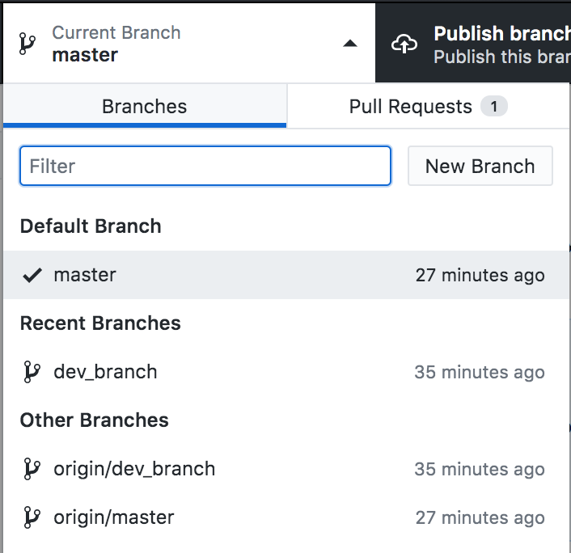

## Merging
What is this splicing exactly? It's the "merge" operation. Merging is best done when there aren't conflicts between the new cold and the old code, but Git helps you handle conflicts when they arise.

This is one of the main strengths of GitHub—it's very good at automatically merging when it can, and otherwise pointing out where the "merge conflicts" are, i.e., the places where you need to tell it what code to keep. Let's do a quick example:

```bash
echo "original file contents" > my_file
git add my_file
git commit -m "added a new file"
git push origin master
```

Okay! We made some code.

```bash
git checkout -b dev_branch  # swap to a new branch for dev
echo "a newly rewritten file" > my_file
echo "a cool change" >> my_file
git add my_file
git commit -m "rewrote first part, added more"
git push origin dev_branch
```

Now we have a dev branch with some new code. Could we merge this? Why or why not?

(yes! we could. dev changes would overwrite master. but let's hold off on merging back in)

Further:
```bash
git checkout master
echo "a newer change" >> my_file
git add my_file
git commit -m "a newer change"
git push origin master
```

So what now? Can we merge? There's an even newer change on Master that an overwrite would lose...

## Pull Requests
When you want to want to merge branches, you create a pull request. This is how GitHub handles merges (and you'll find that command line Git isn't very fun to do merges with when there are conflicts).

Let's hop on GitHub and see if we can do our branch merge from before:

* 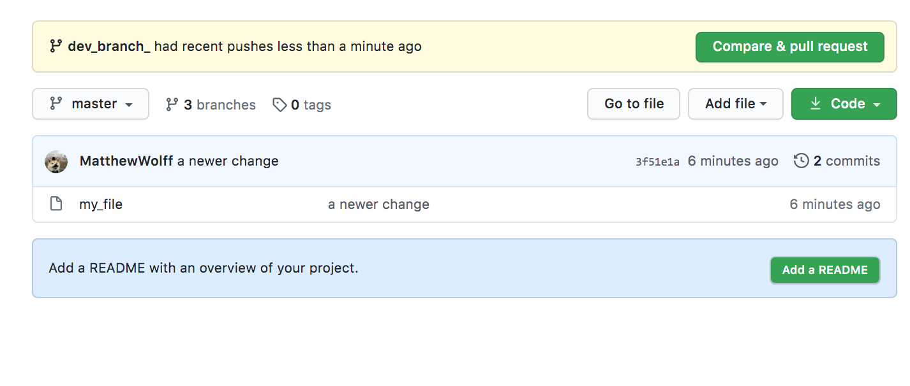
* 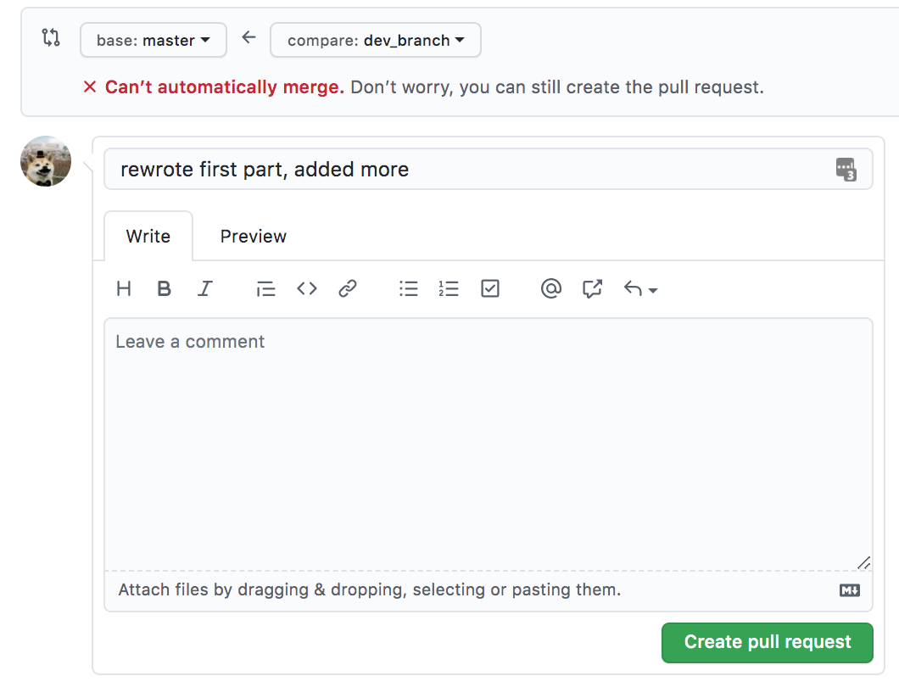
* 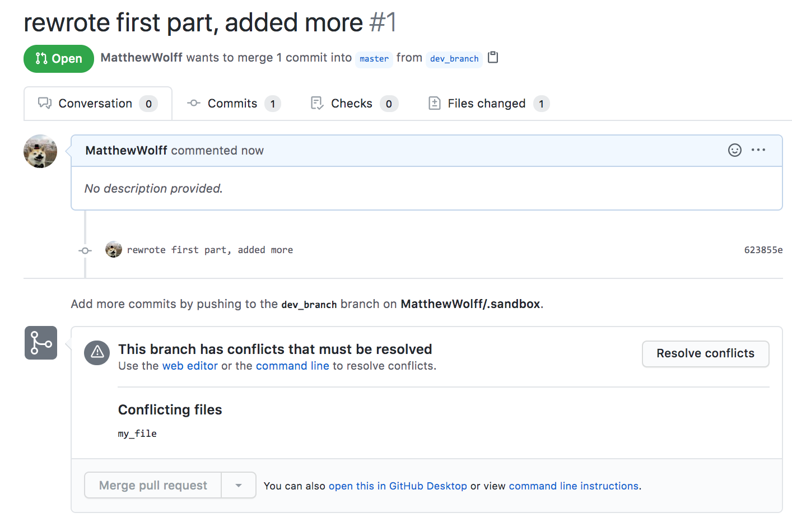
* 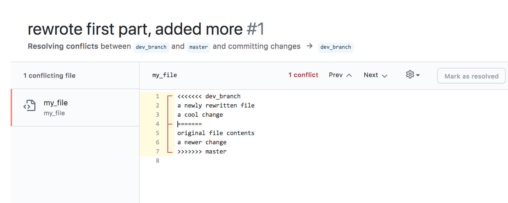
* To resolve the merge conflict, you'll need to get rid of the "<<<<<" and ">>>>>" symbols—they communicate which code belongs to which branch.
* 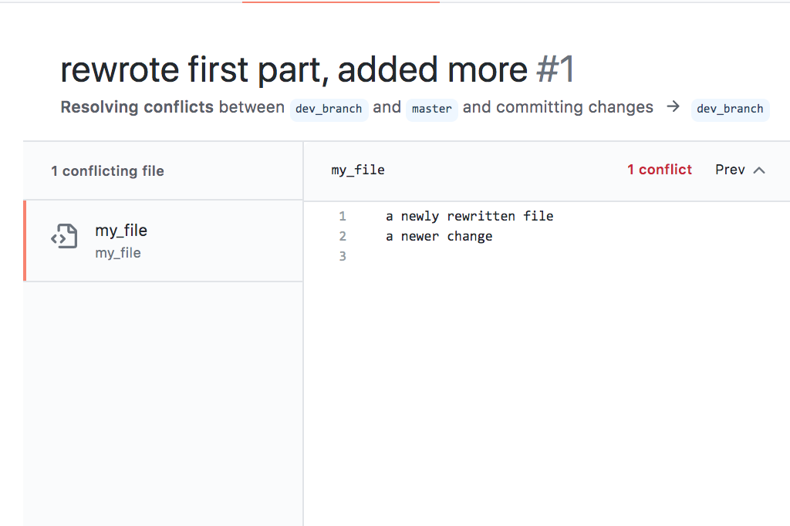
* 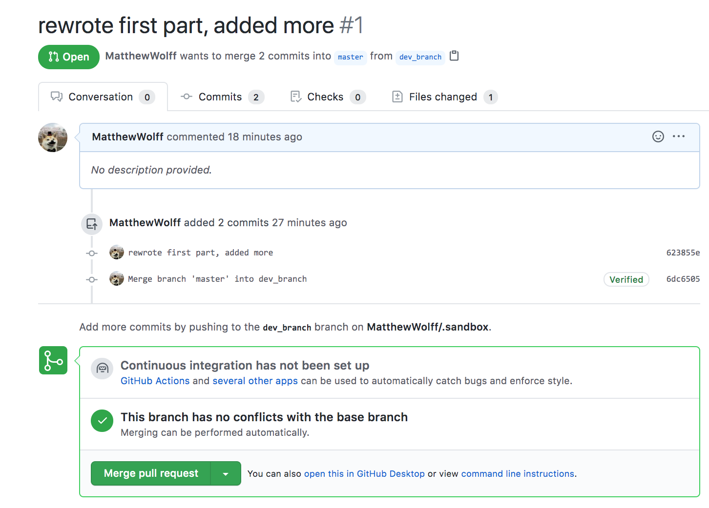


## Forking
Let's say you find a great package on GitHub that fits your use-case, but it's written in Python 2 and has a few bugs. Let's say that the owner of this package is pretty busy. So what do you do? We fix it our self and then make a pull request!

If you just clone someone's repo, you'll run into trouble when you try to push—you don't have permission! Therefore, let's fork it. On GitHub, this will create a copy of the repo under *your account*. Even if the owner deletes the original repo, you still have yours. Additionally, it's easy to create a pull request from your fork of their repo!

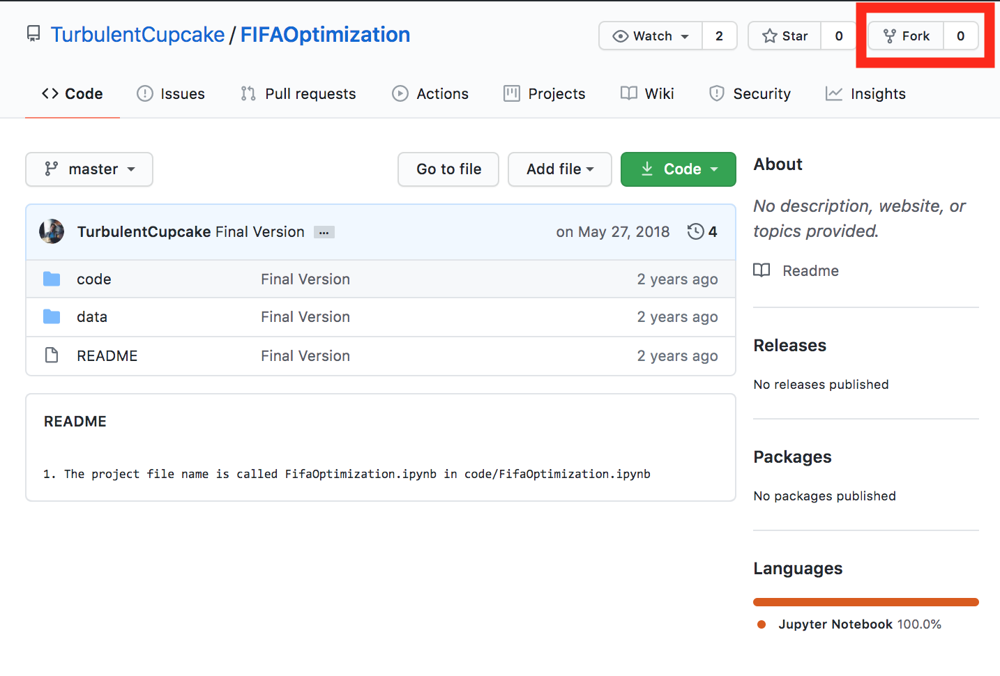

### Forking vs. Branching
These are both ways of adding on to the main code. There are some philosophical differences and Git-level differences between them.

* Both can be used for pull requests
* Both will create a copy of the code
* Forking creates the copy under your account
* Branching creates a new branch under the original code (need permission)

## So these are all words, but can you give an analogy?
I think it all comes together like growing a **tree**. All together, it's a gradual process where you can curate designs and shapes with the wood. You can keep the blinds closed or let specific people into your house!

**A Bed with Soil**: Having a GitHub or GitLab account is having a place to grow your plant. It's your soil.

**A Seed**: Creating the repo is like planting a seed—now you can watch it grow.

**Taking up Nutrients...**: Adding changes to your files! These are what you need to grow the project.

**Growing Taller**: Committing and pushing those changes to your project grows it. Commit after commit, the project grows bigger.

**Branching**: Very literal here. You're growing out a new branch from the trunk. The trunk will continue to be the main part of the tree, but the branch can grow separately.

**Splicing A Branch Back In**: Merging! You're reintroducing a branch that previously diverged. Now it's part of the main tree again and brought back some changes with it.

This metaphor falls apart a bit once you start factoring in other people. For example, what exactly is a merge conflict on a bonsai tree? What is rebasing? There's probably a joke about `cherry-pick`ing here (a surprisingly useful git command). But it's still a useful starting analogy.

---

## What Is It Under The Hood?
Complex and abstract. It's essentially a giant python dictionary with a few different types of objects in it (tree objects, commit objects, and blobs). At the same time, it holds within it a graph structure. Most people use it for years and years without ever bothering with what's going on underneath and, honestly, knowing how it is implemented won't drastically improve your ability to work with it.

---

# Example
Let's create a repository!

1. You need to have a GitHub account
2. You need to have GitHub Desktop installed

So let's get started! GitHub has a few cute features with repos. Whenever you're looking at a repo, if there's a document named "README.\*", it will be displayed! The most common format is [Markdown](https://www.markdownguide.org/basic-syntax/), which uses the extension "\*.md". It's considered good practice to always include a README in the root of your repo with information about it, such as instructions on using it.

GitHub also has a few repository names that it can treat differently. For example, if you name a repo "[username].github.io", GitHub will actually create a new address for you there, and you can create your own small, static website! Try visiting [matthewwolff.github.io](https://matthewwolff.github.io)! Today, however, we're going to create a different kind of specially named repo.

1. Open GitHub desktop
2. Create a new (local) repository  
	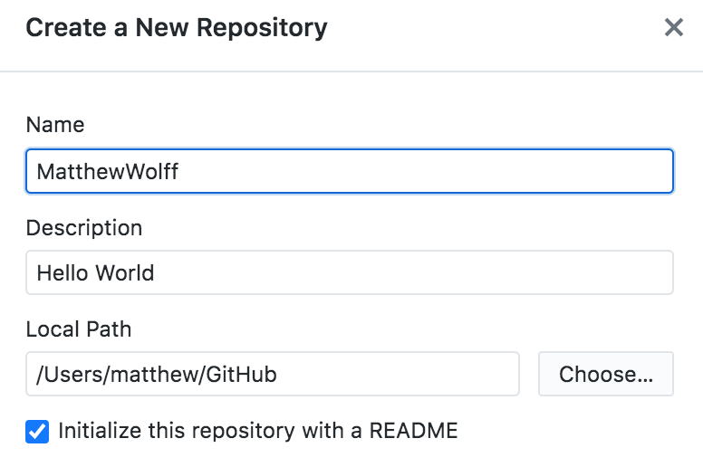
	- ctrl-N or CMD-N
	- The name will be your github username
	- Initialize it with a README
		- what is a readme?
		- what is markdown?
3. Publish your repository
	- Make sure it's public!
	- There's already one automatic commit to it
4. Go to [GitHub](https://github.com) on your profile
5. Enable this "special" repo so others can see it!
6. Go back to your files. Change the README.   
	- You now have a local repo. Let's change the README to a small intro for your github account. Mine is below!  
	```md
	# Hey! 👻
	* UW ➡️ Computer Science, Genetics & Genomics
	* CMU ➡️ Computational 🅱️iology, Data Science

	
	
	```
7. Commit and Push!
8. Go to [GitHub](https://github.com) on your profile again

	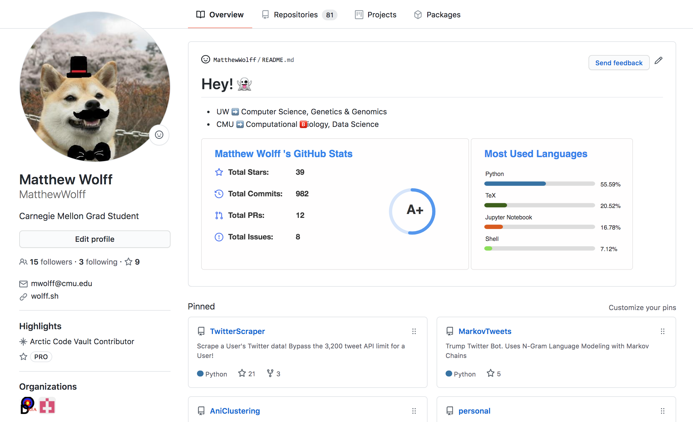

---

# Making a Pull Request
1. Create a new branch using GitHub desktop
2. Make some changes
	- Commit them! Push them to origin!
3. Create a pull request! (will open Github)
4. Merge the pull request
5. Profit


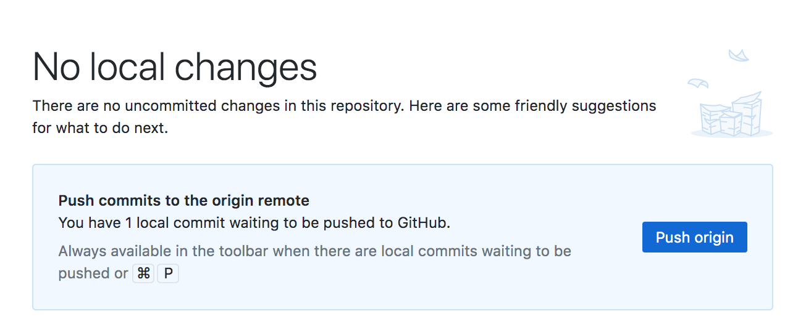
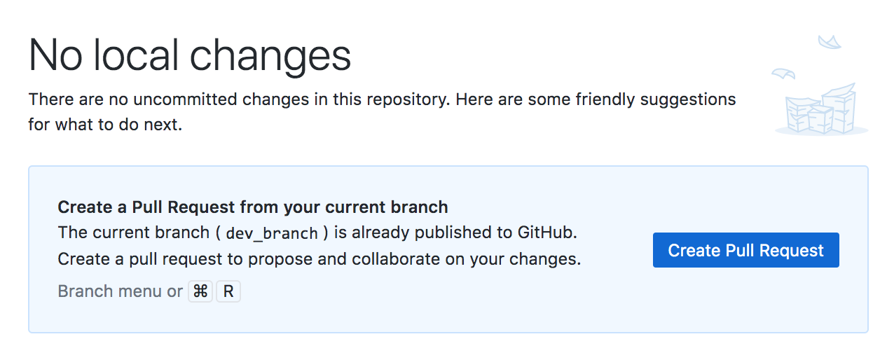
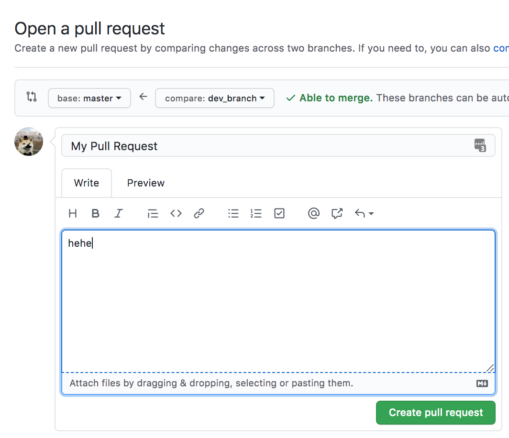
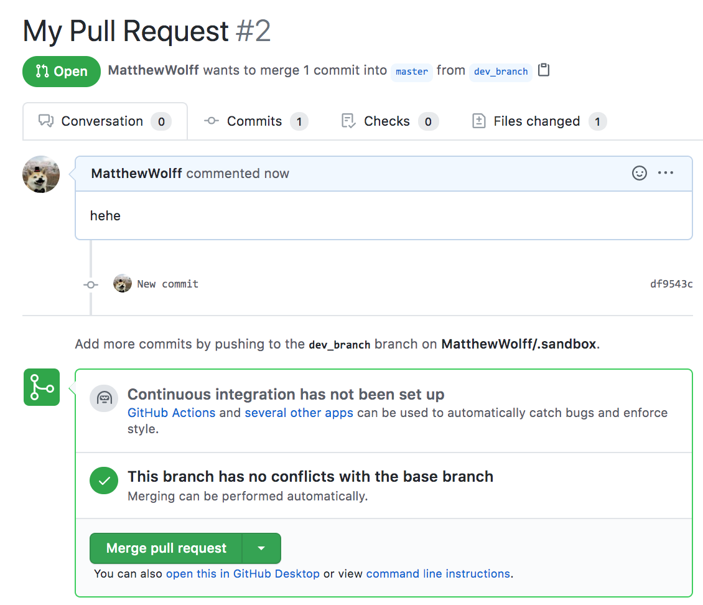
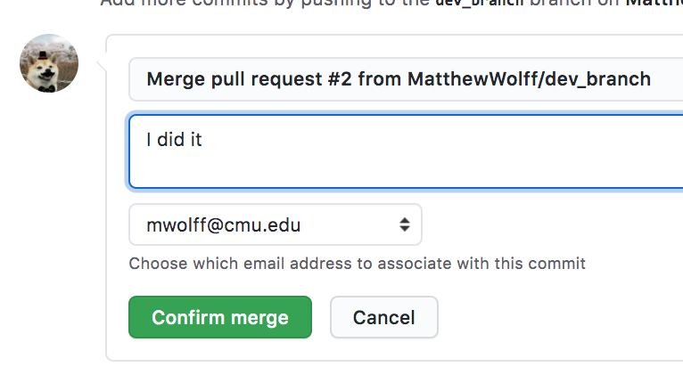
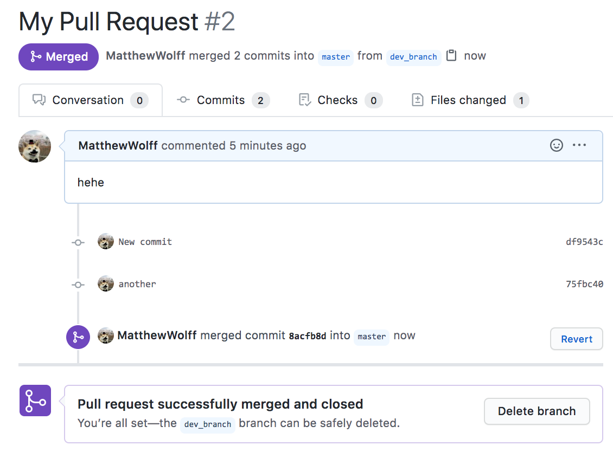

---


## .gitignore
This deserves it's own little section, because you'll typically want to use these. Generally you want to be careful about blindly adding folders in Git. Why? Because there's probably some big or sensitive files in them somewhere that you don't want to upload.

But adding things manually is so tedious... what if we could just specify what we want to ignore?

Enter `.gitignore`. This is a special file (at the root of your repo) that git checks to remember what NOT to consider when it's checking what you've changed. It also prevents certain files from being added when you add entire directories. It's very useful when you don't want to upload large data files, secret credentials, or small config files created by your IDE!

#### [gitignore.io](https://gitignore.io) - very useful for autogenerating this for certain platforms/languages/tools

---

# Git Commands

## Creation: `git clone`
If you create your repo on GitHub first, you can copy the url and use it with `git clone`
```bash
> git clone https://github.com/MatthewWolff/.sandbox
Cloning into '.sandbox'...
remote: Enumerating objects: 25, done.
remote: Counting objects: 100% (25/25), done.
remote: Compressing objects: 100% (14/14), done.
remote: Total 25 (delta 2), reused 20 (delta 1), pack-reused 0
Unpacking objects: 100% (25/25), done.
>
```

## Creation: `git init` and `git remote`
This is how you create project locally if you already have existing code! You can copy the URL of the GitHub repo you created:
```bash
git init # create the .git folder
git remote -v # you have nowhere to send your changes!
git remote add origin https://github.com/MatthewWolff/.sandbox
git remote -v # origin is now set!
```

## `git status`
Git will automatically evaluate which files have been changed, created, or deleted, and will then give you a quick report
```bash
> git status
On branch master

No commits yet

Untracked files:
  (use "git add [file]..." to include in what will be committed)

	README.md
	images/
	index.html

nothing added to commit but untracked files present (use "git add" to track)
```

## `git add --all`
A nice short-hand to add all the files at once! It's recursive, so be careful

## `git commit -m "my message"`
It's important to have a descriptive message, especially if you're working with other people. Saying "Fixed bug" isn't very useful!

## `git push`
Git is decentralized. Your repository is local until you make it global. Use `git push` to send your changes off to the repository

## `git pull`
If you're working on a project on a lab computer and a home computer and making changes from both, pull the changes that you pushed from the other computer! Also, if you're working with other people you want to make sure you have the latest changes

## `git checkout [filename]`
This one is good to know. If you want to undo all the changes that you made to a file, you can just "checkout" that file from the last commit. Very good for undoing mistakes or accidental changes

## All Together

```bash
echo "i have created a repo on GitHub with this project name"
mkdir my_project && cd my_project
git init
git remote add origin https://github.com/matthewwolff/my_project
git status

echo "# My Project" >> README.md # create a change

git add --all
git commit -m "initial commit"
git push # publish it

rm README.md # oops
git checkout README.md # all better
```

---

# Best Practices
Using Git correctly helps future you and your teammates

* Make clean, single-purpose commits
* Don't use `--force`
	- it will overwrite other's changes, and you only need to use it when you've done something bad
* Write meaningful commit messages
* Don’t alter published history
	- I do this A LOT, but only on my personal projects
	- You can re-write git history, but if anyone else is working with your code, it really screws them up and they will have to deal with a lot of errors when trying to merge or pulling
	- Some companies use *advanced* git configurations to prevent this (look into "git hooks")
* Don’t commit generated files
	- if your code generates files every time you run it, don't bother committing those!
* Don't commit really big files that change often
	- your `.git/` folder will be bloated and you'll have to use a tool like [`bfg`](https://rtyley.github.io/bfg-repo-cleaner/) to clean it out
* Don't commit sensitive information
	- This goes without saying, but if you submit passwords or API keys, you'll need to edit the git history
	- You can't just submit a new commit, because someone could look at older commits
	- Use [`bfg`](https://rtyley.github.io/bfg-repo-cleaner/) to fix this mistake

----

# Closing
At this point, you should feel like you know how to add and commit changes, as well as have a light grasp on what you shouldn't do when using Git.

---

# Appendix

### Git Integration
Almost every IDE (Integrated Developer Environment) that you use has git integration! For instance, Atom, IntelliJ, GoLand. It's like a miniature GitHub desktop, except it's not specific to GitHub!

### Are there other Version Control systems?
Yes, there are actually a few, and the following list is not exhaustive:

* Git
	- Created in 2005 and currently the most used
	- Decentralized, so you don't need a central server
	- Can have local changes and use it completely offline
	- Written in C
* Mercurial
	- Decentralized, like Git
	- Doesn't have a Merge feature (some people really don't like that)
	- Written in Python
	- Was competing with Git to be used by Linux Kernel, ultimately lost
	- Easier to learn than Git, with better documentation
* CVS [Concurrent Versions System]
	- a dinosaur from the 80's
	- Centralized, runs on your server
	- You "check out" code, make changes, then "check in"
* SVN [Apache SubVersioN]
	- A better version of CVS
	- Centralized
	- Not *totally* uncommon

### Cool Commands
I have dozens of bash aliases set up for certain git commands. It helps to not need to remember or worry about certain things, like which branch you're on.

* `git whatchanged -p --abbrev-commit --pretty=medium`
	- HEAVEN SENT. This lets you view a `diff` of the past commits
	- extremely useful to jog your memory on what was changed in the last commit
* `git diff`
 	- this shows the you the difference between your current files and the last commit. Only more useful than the above when you haven't committed yet
* `git reset`
	- This will do a **soft** reset and unstage any changes
	- Useful for when you accidentally `git add` a file
* `git log --oneline --decorate --graph`
	- see a brief, visual summary of the branch histories
* `git status -s`
	- see which uncommitted files have changed!
* `git [push/pull] origin "$(git_current_branch)"`
	- this uses a built-in git method to grab your current branch
	- most useful when you're working with branches
* `git stash` and `git stash pop`
	- When you're switching between branches and you don't want to commit your changes yet, you can simply stash them. When you switch back to the branch, use `git stash pop` to pop them off the stash stack (data structures!)
* `git cherry-pick`
	- This let's you pluck a single commit from a different branch and add it to your current branch
* `git pull --rebase`
	- This is what some people actually use as their default pull command  
	> "Whenever I pull, under most circumstances I git pull --rebase. This is because I like to see a linear history (my commit came after all commits that were pushed before it, instead of being developed in parallel). It makes history visualization much simpler and git bisect easier to see and understand. A specific circumstance in which you should avoid using `git pull --rebase` is if you merged since your last push. You might want to `git fetch; git rebase -p @{u}` (and check to make sure the merge was recreated properly) or do a normal merge in that circumstance."

### Naughty Commands
Let's talk about what you *shouldn't* do, but might find useful. These all have to do with re-writing history. As a rule of thumb, you know that you're doing something bad when you have to use `git push --force`, so please keep that in mind.

When you use the `--force` flag, that means your local repo disagrees with the origin. However, if you haven't **`pushed`** yet, then you can manipulate all your local commits however you want! That's the ideal use case for these.

* `git reset --hard [COMMIT HASH]`
	- Permanently time travel backwards to a specific commit
	- This will destroy any changes you've made since then unless you've pushed them
	- Find the commit hash using `git log`
* `git commit --amend`: edit your last commit message
	- I use this a lot for quick adjustments before I push
* `git add [file] && git commit -v --no-edit --amend`
	- This adds a file to your last commit and re-submits it

An alias I personally use a lot when I'm making lots of small adjustments to something I just pushed is:
```bash
alias 'oops!'='git add --all && git commit -v --no-edit --amend && git push -u --force $(git_current_branch)'
```

----

## Plug: Oh-my-zsh Git Aliases
If you use [Oh-My-Zsh](https://ohmyz.sh/) (I love it) instead BASH and have the `git` plugin, you have automatic access to [a plethora of git aliases](https://github.com/ohmyzsh/ohmyzsh/wiki/Cheatsheet#git). As a small plug, Oh-My-Zsh is a ZSH framework that adds a ton of functionality to your terminal and has lots of [different shell prompts or "themes"](https://github.com/ohmyzsh/ohmyzsh/wiki/Themes). Overall: Zsh + oh-my-zsh framework will give you auto-completion, tab completion, several cool themes, programming language integration and like bash is POSIX compliant (I suggest you not learn anything that isn't—it won't be generally portable knowledge).

You can try out my personal ZSH + oh-my-zsh set-up, which will also make the aliases available to you as long as you're in ZSH:
```bash
curl -fsSL tryzsh.wolff.sh | bash
```
